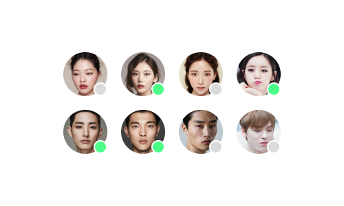
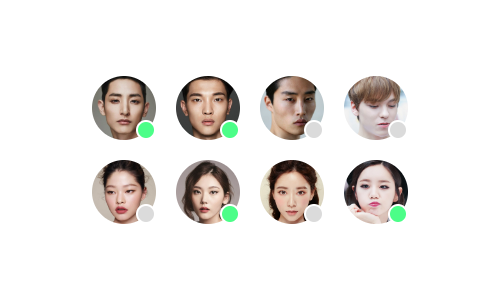

# HOMEWORK 1

- 작성일 : 2024.05.04
- 과제 내용: 주어진 이미지 소스를 이용해 레이아웃 구현하기
- 주 요구사항: float을 사용한 레이아웃 구성, flex를 지원하는 브라우저 환경 레이아웃 추가 구성

&nbsp;  
### **결과 이미지**

  
float을 사용했을 때  
  
flex를 사용했을 때

&nbsp;
### 과제 리뷰
과제를 처음 받았을 때는 크게 어렵지 않은 수준으로 보였는데, 생각보다 오래 걸렸다.
가장 문제가 된 점은 스타일 속성에 익숙하지 않아서 내 예상대로 구현되지 않았다는 점이다.
분명 코드를 입력하고 내가 생각한 대로 움직이길 바라면서 서버를 동작시키면 요소가 없어지거나 이상한 곳으로 날아가기도 했다.
그래도 내가 작성한 코드를 바로 구현시켜서 볼 수 있다는 것은 너무 재미있었다.
또 간단한 과제이지만 깔끔한 레이아웃을 구현하는 것이라 그런지 결과가 더 마음에 들었던 것 같다.

&nbsp;
### 나의 생각
- 생각한 대로 요소가 움직여주질 않았다.
- 조금 더 범용적이고 동적인 코드를 짜고 싶었으나 JavaScript 없이 구현하기는 쉽지 않았다.
- float 요소가 부모의 크기를 인식하지 못한다는 것은 많이 불편했다.
- flex는 적용을 받는 아이템이 아니라 컨테이너에 속성을 조절해 줘야 하는 것이 꽤 헷갈렸다.
- 수업을 들을 때는 각 브라우저별 지원하는 CSS 스타일을 확인하고 사용하지 못하는 스타일을 구분하기만 하면 됐는데, 실제로 float으로만 구현하기 시작하니까 상당히 넓은 시야를 가지고 코드를 짜야 한다는 것을 느낄 수 있었다.
- 수업 때 들은 코드를 사용함과 동시에 스터디하면서 익힌 코드들, 검색을 통해서 새로 발견한 코드들을 활용하면서 실전만큼 공부가 되는 건 없다고 다시 한번 느꼈다.