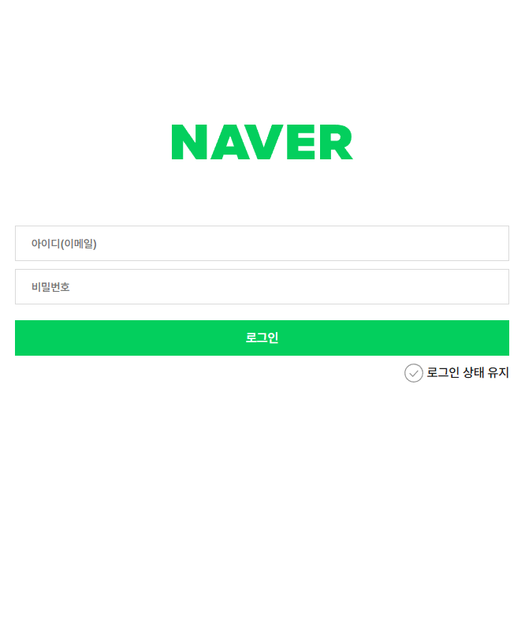

# HOMEWORK 2

- 작성일 : 2024.05.11
- 과제 내용: 주어진 소스를 사용해서 NAVER 사이트의 로그인 페이지 구성해 보기
- 주 요구사항: 미디어 쿼리를 활용한 반응형 레이아웃 구성, 폼 서식을 키보드로 접근 가능하도록 구현

&nbsp;  
**참고 이미지**

  
모바일 퍼스트 레이아웃 디자인  
  
데스크탑 스타일 레이아웃 디자인

&nbsp;
### 과제 리뷰
선생님께서 첫 주부터 꾸준히 말씀하신 "본인은 마크업이 더욱 어렵다."라고 말씀하신 이유를 점점 알 것 같다.
아는 게 많아질수록 넣을 수 있는 태그와 요소는 많아지는데 비해, 적절하게 사용하는 것이 난이도가 어렵다 보니 마크업이 어렵게 느껴진다.
그럼에도 레이아웃 구성하는 게 점점 재미있고, 스타일을 씌워서 원하는 결과물을 봤을 때 기분이 너무 좋다...
이번에는 필수 요구사항은 아니었지만 손으로 직접 레이아웃을 구성한 사진을 넣고 싶었으나 막상 그려보니 생각보다 쉽지 않았다.
그래서 결과라고 부르기 어려운 무언가가 나와서 이번 과제에서는 올리지 못했지만 다음부터는 종이를 옆에 끼고 사는 게 나을 듯하다.
과제에서 요구하는 사항을 전부 구현하기는 했지만, 효율적으로 구현했는지는 미지수이다.
그럼에도 이번 과제를 완성했다는 것에 조금은 만족한다!!

&nbsp;
### 나의 생각
- 없던 마크업을 처음부터 전부 쌓아가는 것은 아직 너무 힘들었다.
- 그렇다고 수업 때 공부했던 컴포넌트를 재활용하는 것이 쉽지는 않았다.
- 이론만 계속 공부하는 것보다 수업 때 여러 가지 실용적인 내용들 듣고, 직접 구현하는 과제를 통해 복습을 하니까 훨씬 이해가 잘 되는 것 같다.
- 반응형 웹사이트를 도대체 어떻게 만드는지 궁금했는데, 미디어 쿼리를 직접 사용해 보니 흥미로웠다.
- 모든 요소를 flex로만 만드는 경향이 생기는 것 같아서, 의식적으로 float을 통해 배치를 해봤다.
- 특히, 모바일 퍼스트의 input 요소가 화면을 따라 늘어나도록 하는 게 많이 헷갈렸다. (너무 여러 번의 태그가 감싸고 있어서 더욱 헷갈렸다.)
- 버튼 요소를 숨기고 배경 이미지를 통해 버튼을 만드는 것은 눈속임이지만, 문제없이 동작한다.
- 같은 원리를 적용해 가상 요소를 통해 글씨로 표시되는 버튼을 생성했다.
- 키보드로 전부 접근하게 만드는 것은 간단해 보이지만, 스타일을 고려해 설계하면 쉽지 않다.
- 아직 접근성 관련해서 (ARIA 관련 속성을 사용하지 않고는 더욱) 내가 제대로 정보를 제공하고 있는지 잘 모르겠다.